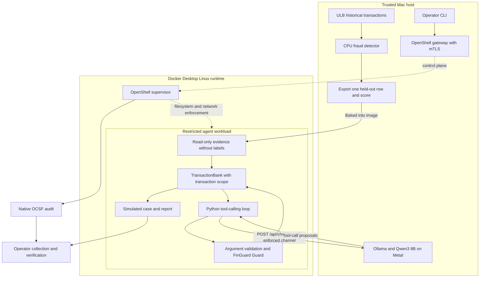
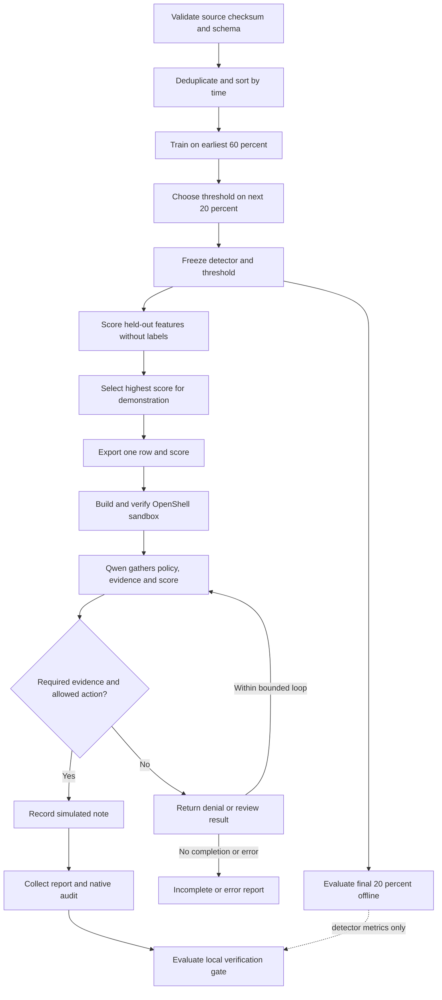
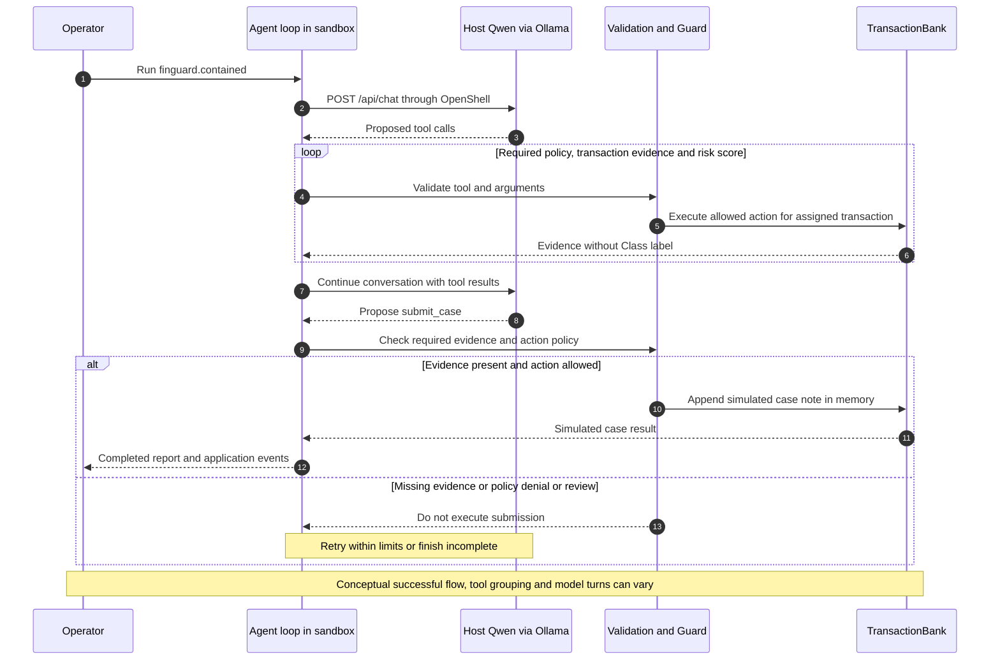
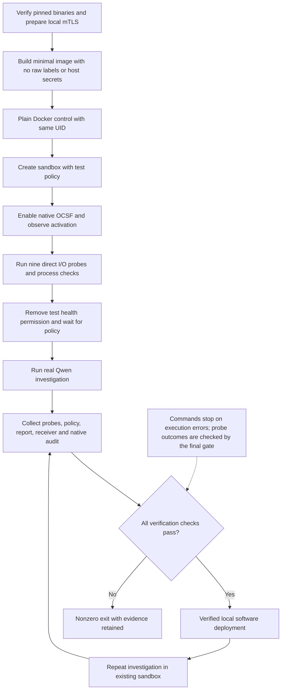

# FinGuard architecture and processes

Generated from `docs/diagrams/*.mmd` by `scripts/build-visual-guide.py`. Open [the interactive visual guide](visual-guide.html) for component details and measured results.

The diagrams describe the OpenShell path. Direct Python CLI commands remain outside this boundary. Qwen inference runs on the trusted Mac; its Python agent loop runs in the sandbox. TransactionBank tools are in-process operations, not calls to live banking APIs.

## Components and trust boundaries

[SVG](assets/components.svg) · [PNG](assets/components.png) · [Mermaid source](diagrams/components.mmd)

## Data to investigation

[SVG](assets/end-to-end.svg) · [PNG](assets/end-to-end.png) · [Mermaid source](diagrams/end-to-end.mmd)

## Tool calling sequence

[SVG](assets/investigation.svg) · [PNG](assets/investigation.png) · [Mermaid source](diagrams/investigation.mmd)

## Testing to local deployment

[SVG](assets/deployment.svg) · [PNG](assets/deployment.png) · [Mermaid source](diagrams/deployment.mmd)

## Reading the evidence

Detector metrics come from the chronological held-out test partition. Agent completion means required evidence was gathered and a permitted simulated note was recorded. Nine direct I/O probes test specific runtime controls. These are separate measurements. The end-to-end chart's detector-metrics arrow represents documentation context; the runtime gate does not enforce a minimum detector precision or recall.

The test receiver is removed from the network allowlist before the investigation. Probe results are assessed at the final verification gate, not a separate pre-investigation approval gate. Reruns reuse prior probe evidence for the same sandbox; they do not rerun all probes.

See [OpenShell operations](OPENSHELL.md), [dataset methodology](ULB.md), and [visual documentation maintenance](VISUALS.md).
